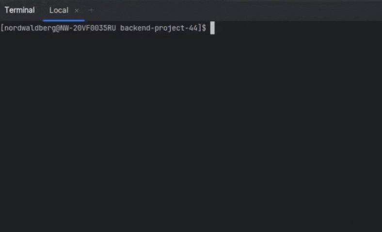

# 🧠 __Brain Games: ***5 Console Games Pack***__

[](https://github.com/nordwaldberg/backend-project-44/actions)</br>
[](https://codeclimate.com/github/nordwaldberg/backend-project-44/maintainability)
___

> Each of the games contains ***3 questions***, if ***all answers is correct*** — user ***wins*** the game,
> after ***one incorrect answer*** — user ***loses*** and the game ends.
>
> ***Good Luck! 🍀🦾***
___

### ◽ installation
___
#### 1. clone this repository to your local machine in any convenient way, for example: 
```
git clone [repo URL]
```
#### 2. install dependencies
```
make install
```
#### 3. install ***brain-games*** package locally
```
npm link
```
#### 4. run any game and enjoy ✨
___
<div style="text-align: center">
    
</div>

### ◽ brain-even game
___
> ***Rules:*** given a number, if the number is ***even*** — write ***yes***, otherwise — write  ***no***
```
    brain-even
```
___
<div style="text-align: center">
    
</div>

### ◽ brain-calc game
___
> ***Rules:*** given an expression ***[add, substract, multiply]***, calculate its result and write it
```
    brain-calc
```
___
<div style="text-align: center">
    
</div>

### ◽ brain-gcd game
___
> ***Rules:*** given two numbers, find ***the greatest common divisor*** and write it
```
    brain-gcd
```
___
<div style="text-align: center">
    
</div>

### ◽ brain-progression game
___
> ***Rules:*** given ***an arithmetic progression*** without one of the values, find ***the missing number*** and write it
```
    brain-progression
```
___
<div style="text-align: center">
    
</div>

### ◽ brain-prime game
___
>***Rules:*** given a number, if the number is ***prime*** — write ***yes***, otherwise — write  ***no***
```
    brain-prime
```
___
<div style="text-align: center">
    
</div>